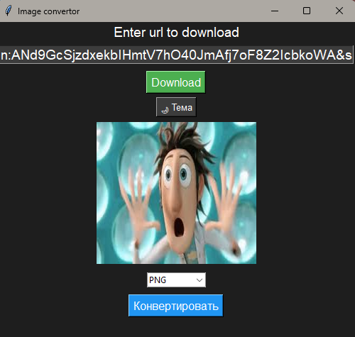

# Image convertor

## 🚀 About
**Image convertor** is simple tool for download/convert images.   
Its allows to convert to *PNG, JPG, WEBP, BMP, GIF*. 

## 📋 Requirements
- Python 3.x
- Pillow

## ⚙️ Usage
1. Install [Python 3.x](https://www.python.org/downloads/) ([3.14](https://www.python.org/downloads/release/python-3143/) is optimal)
2. Download archive
3. Install requirements
   * `pip install -r requirements.txt`
4. Open main.py
   * `py .\code\main.py`
5. Done!

<h2 align="center">📞 Support</h2>
<table align="center">
  <tr align="center">
    <td>
       
    </td>
    <td>
       
    </td>
    <td>
       
    </td>
  </tr>
  <tr align="center">
    <td>
      <a href="https://discord.com/users/programmduck">Click</a> 
    </td>
    <td>
      <a href="https://t.me/programmduck">Click</a> 
    </td>
    <td>
      <a href="mailto:ProgrammDuck@yandex.ru">Write</a>
    </td>
  </tr>
  <tr align="center">
    <td>
      ProgrammDuck
    </td>
    <td>
      @ProgrammDuck
    </td>
    <td>
      ProgrammDuck@yandex.ru
    </td>
  </tr>
</table>
